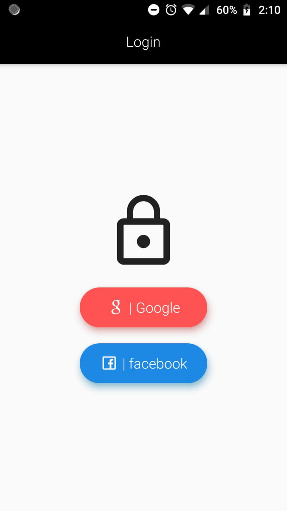
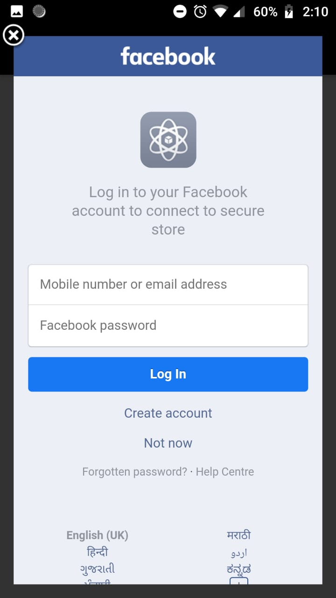
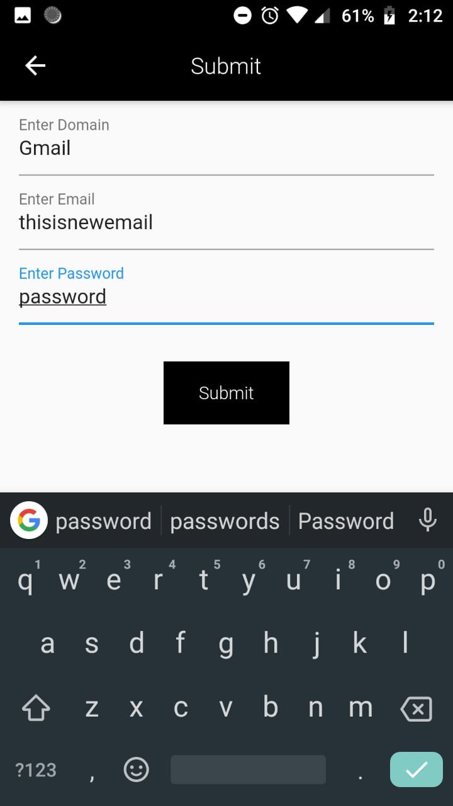
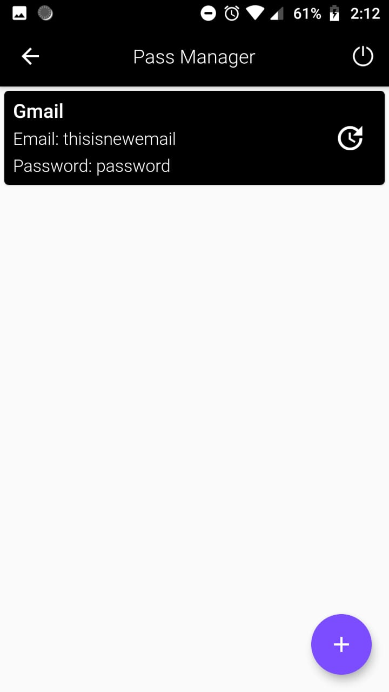
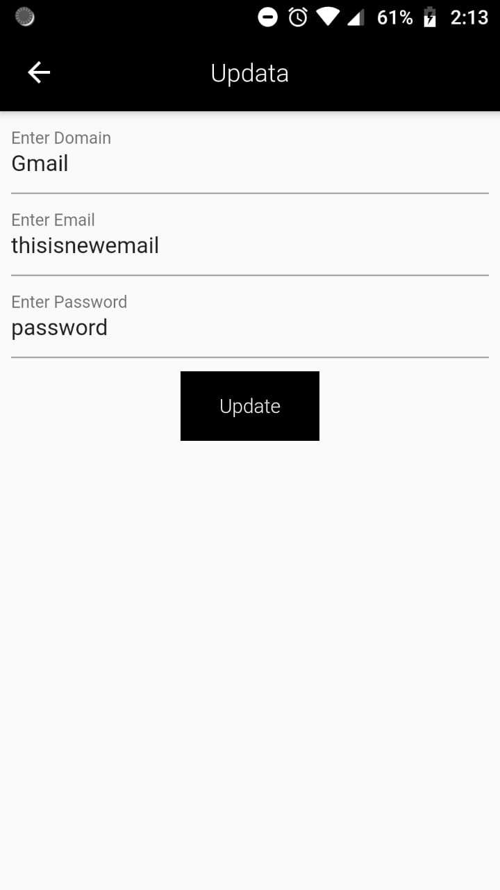

# Secure Password Manager

- [Android](https://github.com/saket-shetty/Post-it/raw/master/build/app/outputs/apk/release/app-release.apk)

Created a Password Manager using flutter and firebase the data is encrypted with user private key and global public key.

Users can login with Google or facebook and will be redirect to new page here they will enter the private key and the data will only be decrypted using that private key.

User can also update the data previously entered and access their data even if they are offline.

<table>
  <tr>
    <td></td>
     <td></td>
     <td></td>
  </tr>
  <tr>
     <td></td>
     <td></td>
     <td></td>
   </tr>
  <tr>
     <td></td>
  </tr>
</table>

Any query: shettysaket05@gmail.com
